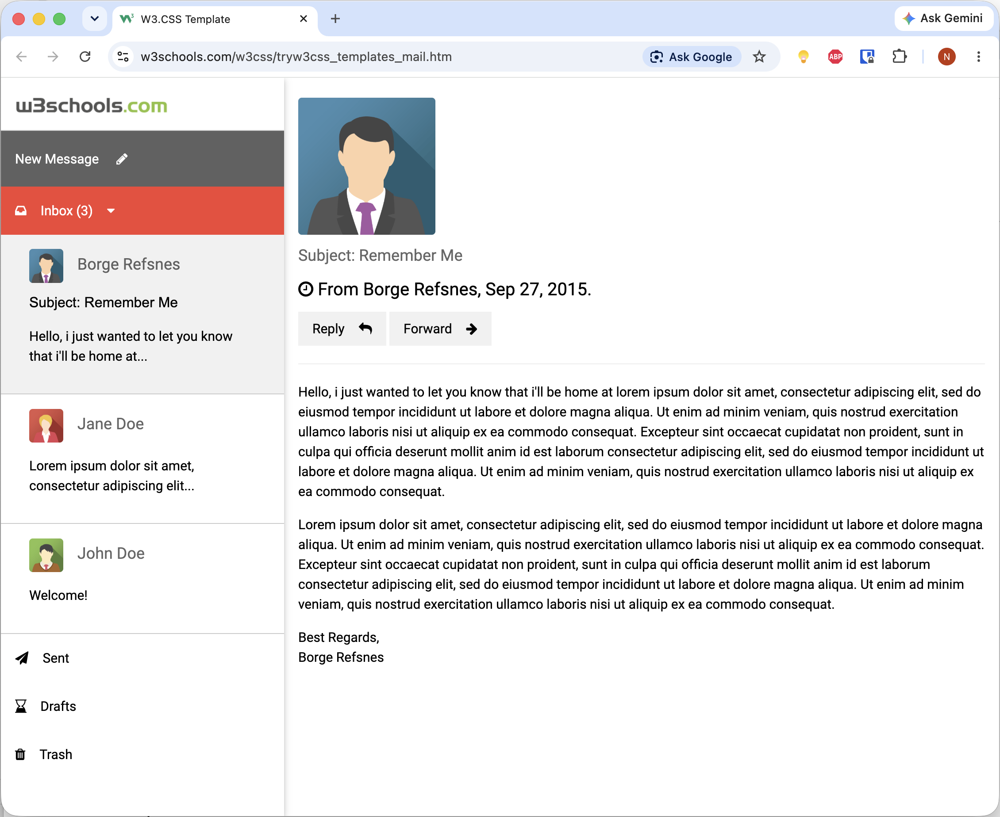

# Week 2 Plan

<!--
- Decompose a webpage into elements - identify blocks, structure and hierarchy
        - Screenshot: ./mail-page-decompose.png
        - Live: https://www.w3schools.com/w3css/tryw3css_templates_mail.htm
        - Code: https://www.w3schools.com/w3css/tryit.asp?filename=tryw3css_templates_mail&stacked=v

- TaskHelm stage-01.a starter code -- CSS rules, selectors, box model

- Add to app   

document.addEventListener("DOMContentLoaded", function() {
    const greeting = document.getElementById('greeting');
    const currentHour = new Date().getHours();
    let greetingText = '';
    
    if (currentHour < 12) {
        greetingText = 'Good morning!';
    } else if (currentHour < 18) {
        greetingText = 'Good afternoon!';
    } else {
        greetingText = 'Good evening!';
    }
    
    greeting.querySelector('h1').textContent = greetingText;
    greeting.querySelector('.eyebrow').textContent = new Date().toLocaleDateString('en-US', { weekday: 'long', month: 'long', day: 'numeric', year: 'numeric' });

    /* attach listener to sidebar links to make bold the active link */
    const sidebarLinks = document.querySelectorAll('aside nav ul li a');
    sidebarLinks.forEach(link => {
        link.addEventListener('click', function(e) {
            sidebarLinks.forEach(l => l.classList.remove('active'));
            this.classList.add('active');
            console.log('Active link:', this.textContent);
            e.preventDefault(); // Prevent default link behavior for demonstration
        });
    });

})

-->

## Tuesday

- Decompose a webpage into elements - identify blocks, structure and hierarchy
    - Screenshot: 
    - Live: https://www.w3schools.com/w3css/tryw3css_templates_mail.htm
    - Code: https://www.w3schools.com/w3css/tryit.asp?filename=tryw3css_templates_mail&stacked=v

- TaskHelm stage-01.a starter code -- CSS rules, selectors, box model
    - [stage-01.a.zip](stage-01.a.zip)

- JavaScript: client-side scripting (`app.js`)
    - Dynamic greeting
    - Active link highlighting

## Thursday

- More JavaScript: working with the DOM and events
- PHP: server-side scripting

## Reading

Read the following chapters from the textbook: **6, 7, 14, 15, and 31**

- As you read, make sure you do all the "Do It Yourself" exercises. You can find resource files for each chapter in the `textbook-code` folder in your `webdev-workspace-...` repository. 

- At the end of each chapter, complete the "Check Your Understanding" questions. **Upload a screenshot** of your completed and checked work to the assignment page on Canvas.

> As you work through these, please ask on Discord if you can't figure something out!
